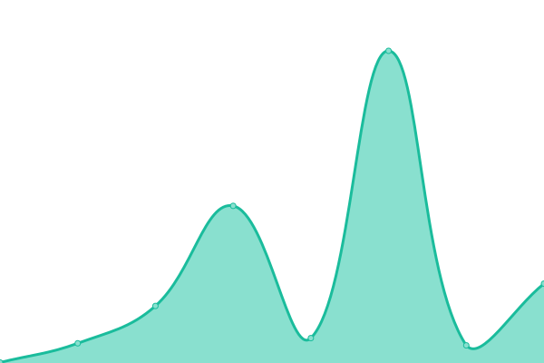

# [📈 Live Status](https://demo.upptime.js.org): <!--live status--> **🟧 Partial outage**

This repository contains the open-source uptime monitor and status page for [Mehdi El Khallouki](mtech-cmd.github.io), powered by [Upptime](https://github.com/upptime/upptime).

With [Upptime](https://upptime.js.org), you can get your own unlimited and free uptime monitor and status page, powered entirely by a GitHub repository. We use [Issues](https://github.com/MTech-cmd/mtech-upptime/issues) as incident reports, [Actions](https://github.com/MTech-cmd/mtech-upptime/actions) as uptime monitors, and [Pages](https://demo.upptime.js.org) for the status page.

<!--start: status pages-->
<!-- This summary is generated by Upptime (https://github.com/upptime/upptime) -->
<!-- Do not edit this manually, your changes will be overwritten -->
<!-- prettier-ignore -->
| URL | Status | History | Response Time | Uptime |
| --- | ------ | ------- | ------------- | ------ |
|  [SquishFactory](https://mymellow.mooo.com/) | 🟥 Down | [squish-factory.yml](https://github.com/MTech-cmd/mtech-upptime/commits/HEAD/history/squish-factory.yml) | 

 0ms
     
 | 

<a href="https://MTech-cmd.github.io/mtech-upptime/history/squish-factory">0.00%</a>
    

|  [HeroDB](https://herodb.mooo.com/) | 🟥 Down | [hero-db.yml](https://github.com/MTech-cmd/mtech-upptime/commits/HEAD/history/hero-db.yml) | 

 0ms
     
 | 

<a href="https://MTech-cmd.github.io/mtech-upptime/history/hero-db">0.00%</a>
    

|  [Dev env](https://develop.twilightparadox.com/) | 🟥 Down | [dev-env.yml](https://github.com/MTech-cmd/mtech-upptime/commits/HEAD/history/dev-env.yml) | 

 0ms
     
 | 

<a href="https://MTech-cmd.github.io/mtech-upptime/history/dev-env">0.00%</a>
    

|  [Asmodeus](https://ashmedai.mooo.com/) | 🟥 Down | [asmodeus.yml](https://github.com/MTech-cmd/mtech-upptime/commits/HEAD/history/asmodeus.yml) | 

 0ms
     
 | 

<a href="https://MTech-cmd.github.io/mtech-upptime/history/asmodeus">0.00%</a>
    

|  [Hugo Netlify](https://myhugonetlifytut.netlify.app/) | 🟩 Up | [hugo-netlify.yml](https://github.com/MTech-cmd/mtech-upptime/commits/HEAD/history/hugo-netlify.yml) | 

 266ms
     
 | 

<a href="https://MTech-cmd.github.io/mtech-upptime/history/hugo-netlify">100.00%</a>
    

|  [Portfolio](https://mtech-cmd.github.io) | 🟩 Up | [portfolio.yml](https://github.com/MTech-cmd/mtech-upptime/commits/HEAD/history/portfolio.yml) | 

 101ms
     
 | 

<a href="https://MTech-cmd.github.io/mtech-upptime/history/portfolio">100.00%</a>
    

|  [Twitchwind](https://mtech-cmd.github.io/Twitchwind/) | 🟩 Up | [twitchwind.yml](https://github.com/MTech-cmd/mtech-upptime/commits/HEAD/history/twitchwind.yml) | 

 56ms
     
 | 

<a href="https://MTech-cmd.github.io/mtech-upptime/history/twitchwind">100.00%</a>
    

|  [This page](https://mtech-cmd.github.io/mtech-upptime/) | 🟩 Up | [this-page.yml](https://github.com/MTech-cmd/mtech-upptime/commits/HEAD/history/this-page.yml) | 

 55ms
     
 | 

<a href="https://MTech-cmd.github.io/mtech-upptime/history/this-page">100.00%</a>
    

<!--end: status pages-->

[**Visit our status website →**](https://demo.upptime.js.org)

## 📄 License

- Powered by: [Upptime](https://github.com/upptime/upptime)
- Code: [MIT](./LICENSE) © [Anand Chowdhary](https://anandchowdhary.com), supported by [Pabio](https://pabio.com)
- Data in the `./history` directory: [Open Database License](https://opendatacommons.org/licenses/odbl/1-0/)
